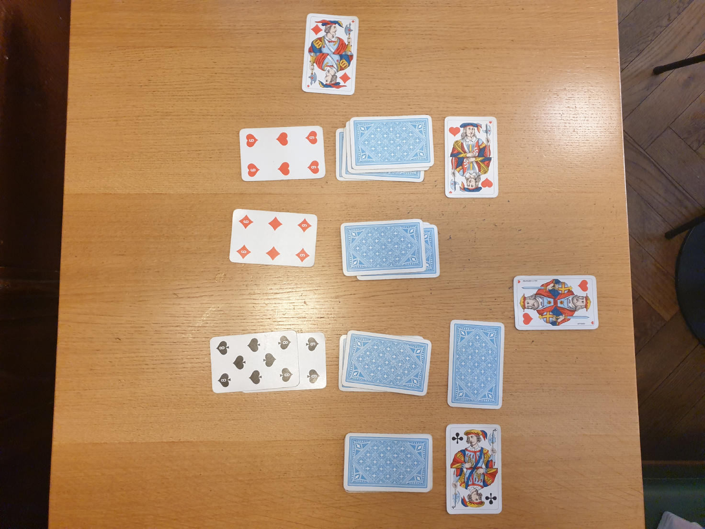

# JEU CIRA

## MATÉRIEL
- Paquet  de 36 / 52 cartes
- Au moins 3 (2 ?)  personnes

## MISE EN PLACE
Sortir les figures du paquet. Mettre les 4 valets à part et mélanger le reste des figures en un tas face cachée. Mélanger les as en un tas face cachée. Disposer les valets en une ligne horizontale. Trier les cartes numérotées par couleurs (coeur, carreau, pique, trèfle) et en faire 4 tas face cachée, 1 par couleur, disposés en dessous du valet de la couleur correspondante.

## OBJECTIF
Vous êtes des révolutionnaires. Votre objectif est de renverser le pouvoir en place. La partie s'arrête quand chacun des quatre valets a été converti ou vaincu.

## TOUR DE JEU
Chaque joueur·euse jouera l’un·e après l’autre dans le sens horaire. La personne la plus privilégiée commence. À son tour une personne a deux actions possibles :
- Récolter des ressources militantes et les ajouter au pot commun:
- Récolter des ressources implique de tirer une unique carte depuis l'un des quatre paquets situés sous les valets. Cette carte est ensuite ajouté au pot commun.
- Utiliser les ressources du pot commun pour convertir ou vaincre un valet
Convertir un valet demande de défausser des cartes depuis le pot commun pour un total égal ou supérieur à 15 / 20 / 25. Vaincre un valet demande de défausser des cartes depuis le pot commun pour un total égal ou supérieur à 15 / 20 / 25. Il est possible de vaincre un valet converti par un·e·x autre joueur·euse·x. Mais il n'est pas possible de convertir un valet convertir / Convertir un valet déjà converti demande de défausser des ressources pour un total égal ou suppérieur à 15 / 20 / 25 / 30.

Une fois l'action effectuée, lae joueur·euse suivant·e effectue son tour.

## FIN DU JEU
La partie se termine lorsque le dernier valet a été converti ou vaincu, ou lorsque aucune autre action n'est possible (récolter des ressources, vaincre ou recruter un valet).
- Si tous les valets on été vaincus, le jeu se termine par une victoire des anarchistes ; chaque joueur·euse·x gagne 5 points. 
- Si les quatre valets ont été convertis et/ou vaincus, et qu'au moins un·e joueur·euse·x a un valet converti qui n'a pas été vain
- Si ce n'est pas le cas, la personne avec le plus de valets gagne 2 points par valet recruté, les autres perdent 1 point par valet recruté.
- S'il y a une égalité entre le nombre de valets, les personnes à égalité gagent 2 points chacun·e.

 
Effectuer 3/4/5 parties pour déclarer lae gagnant·e final·e du jeu.

Photos

