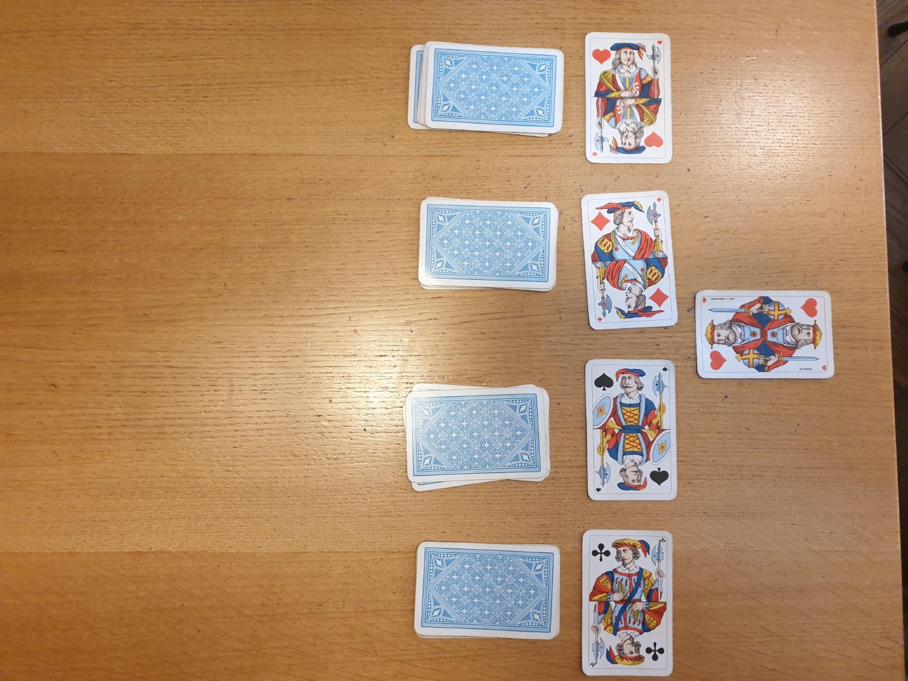

# JEU CIRA

## MATÉRIEL
- Paquet  de 36 / 52 cartes
- Au moins 3 (2 ?)  personnes

## MISE EN PLACE
Sortir les figures du paquet. Mettre les 4 valets à part et mélanger le reste des figures en un tas face cachée. Mélanger les as en un tas face cachée. Disposer les valets en une ligne horizontale. Trier les cartes numérotées par couleurs (coeur, carreau, pique, trèfle) et en faire 4 tas face cachée, 1 par couleur, disposés en dessous du valet de la couleur correspondante.

## OBJECTIF
Vous êtes des révolutionnaires. Votre objectif est de renverser le pouvoir en place. La partie s'arrête quand chacun des quatre valets a été converti ou vaincu.

## TOUR DE JEU
Chaque joueur·euse·x jouera l’unex après l’autre dans le sens horaire. La personne la plus privilégiée commence. À son tour une personne a deux actions possibles :
- Récolter des ressources militantes et les ajouter au pot commun:
- Récolter des ressources implique de tirer une unique carte depuis l'un des quatre paquets situés sous les valets. Cette carte est ensuite ajouté au pot commun.
- Utiliser les ressources du pot commun pour convertir ou vaincre un valet
Convertir un valet demande de défausser des cartes depuis le pot commun pour un total égal ou supérieur à 15 / 20 / 25. Vaincre un valet demande de défausser des cartes depuis le pot commun pour un total égal ou supérieur à 15 / 20 / 25. Il est possible de vaincre un valet converti par un·e·x autre joueur·euse·x, mais il n'est pas possible de convertir un valet déjà converti.

Une fois l'action effectuée, lae joueur·euse·x suivant·e·x effectue son tour.

## FIN DU JEU
La partie se termine lorsque le dernier valet a été vaincu, ou lorsque aucune autre action n'est possible (récolter des ressources, vaincre ou recruter un valet).
### Ligne de défense des valets épuisée
- Si tous les valets on été vaincus, le jeu se termine par une révolution **anarchiste** ; chaque joueur·euse·x gagne 5 points. 
- Si tous les valets ont été convertis ou vaincus, et qu'au moins un·e joueur·euse·x a un valet converti face à ellui, alors le régime change mais demeure vertical. La personne ayant le plus de valets devant elle (convertis, mais non vaincus par d'autres joueur·euse·xs) à la fin gagne 2pts pour chaque valets encore présents, tandis que les autres perdent 1pt par valets devant elleux. En cas d'égalité, la personne la plus privilégiée peut convertir le valet d'une autre personne.
### Ligne de défense des valets partiellement complète
- Si les ressources ont été épuisées et qu'il reste des valets non vaincus, et que des personnes ont des valets convertis devant elles, alors la révolution est un échec et ses instigateurs seront fortement punis. Tout le monde perd 1 point. De plus, les joueur·euse·xs avec des valets devant elleux perdent 3pts par valets recrutés.
- Si les ressources ont été épuisées et qu'il reste des valets non vaincus, mais que personne n'a de valets convertis devant ellui, la partie se solde par un échec de la révolution. Chaque joueur·euse·x perd 2 points.

 
Effectuer 3/4/5 parties pour déclarer lae gagnant·e·x final·e·x du jeu.

Photos

